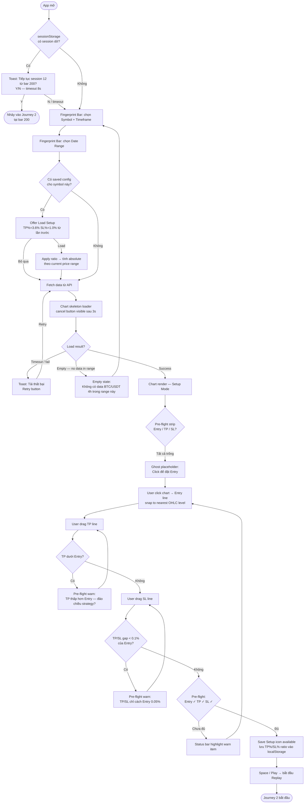
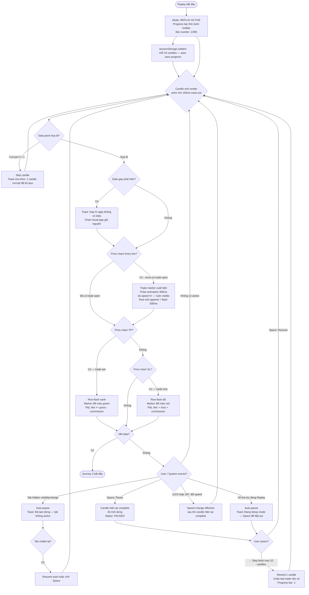
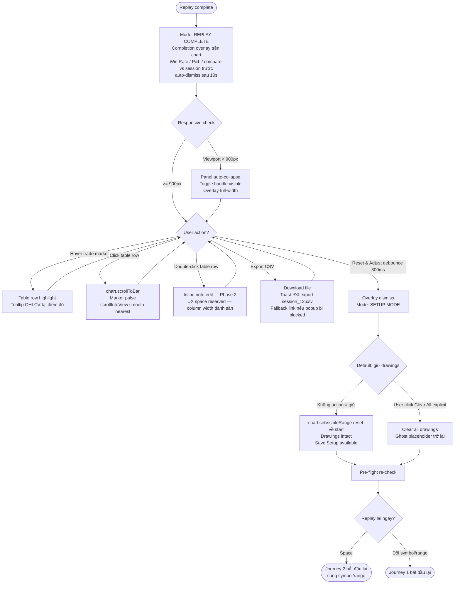

# UX Design Specification stock_backtest_project

**Author:** Narron
**Date:** 2026-04-23

---

<!-- UX design content will be appended sequentially through collaborative workflow steps -->

## Executive Summary

### Project Vision

**stock_backtest_project** là một Visual Bar Replay Tool — thay thế TradingView Bar Replay, self-hosted, zero-cost — giúp trader crypto cá nhân luyện tập strategy bằng cách replay từng nến lịch sử như xem video, với đầy đủ context thị trường tại thời điểm ra quyết định. Tool frame là "trading flight simulator": fail safely, build intuition qua repetition, compress years of experience.

**Core UX value:** Vẽ strategy trực tiếp lên chart (horizontal lines cho Entry/TP/SL) → replay từng nến → thấy kết quả từng lệnh với audit trail đầy đủ — không cần viết code, không đọc số aggregate.

**Design principle: Deliberate simplicity** — ít features hơn TradingView là *mục đích thiết kế*, không phải MVP shortcut. Mỗi indicator, mỗi panel thêm vào là một "variable" làm khó isolate edge của strategy.

### Target Users

**Primary user: Trader crypto cá nhân (Narron)**
- Profitable, win rate 56–58%, kinh nghiệm thực chiến
- Dùng chart hàng ngày — quen với drawing tools trên TradingView
- Kỹ năng tech: intermediate (clone repo, chạy terminal được)
- Device: Desktop/laptop primary (Chrome/Safari), iPad basic support
- Context dùng: Tối sau phiên live, 30–60 phút luyện tập dưới dạng *iteration cycles* (vẽ → replay → adjust → replay lại 3–5 lần liên tiếp)
- Learning style: Learns by doing, không đọc tutorials — experienced user

### Key UX Challenges

1. **Drawing precision với rapid iteration** — Trader không chỉ cần đặt đường chính xác; họ cần *thay đổi SL 10 lần trong 5 phút* để so sánh variants. Cần instant P&L preview trong Setup mode (trước Play) — estimate dựa trên full range data mà không cần replay lại. Price snap và live R:R ratio display khi vẽ là bắt buộc.

2. **Session trust và reproducibility** — Trader cần tin tưởng rằng cùng conditions → cùng kết quả. *Session Fingerprint* — hiển thị exact conditions (symbol, timeframe, date range, line prices) trước khi chạy — là critical UX element để build trust. Look-ahead bias confirmation chỉ cần current timestamp display, không cần complex visual masking.

3. **Visual pattern recognition over table reading** — Trader muốn hiểu "tại sao 3 lệnh này thua" bằng cách nhìn chart, không đọc bảng số. Chart markers (entry/exit dots) là *primary* results view; per-trade table là secondary/collapsible. Visual clustering của markers trên chart quan trọng hơn aggregate statistics.

4. **Empty state & onboarding cho experienced users** — Target user không đọc tutorials. Onboarding tốt nhất = empty state với placeholder drawings mẫu đã sẵn trên chart + progress indicator rõ ràng khi fetch data (5 phút). Critical failure mode: user đóng terminal vì không biết data đang fetch, gây corrupt cache.

5. **Accidental data loss khi switch timeframe** — Switch timeframe xóa tất cả drawings. Không có confirmation dialog thì 20 phút work biến mất sau 1 misclick. Pattern đúng: *Toast + 5-giây timed undo* — zero blocking friction + safety net.

6. **Last-used settings persistence** — Mỗi lần mở app là blank slate gây friction. Trader cần restore previous session state tự động: last timeframe, last date range, last drawing positions. Không cần full session save (Phase 2), chỉ cần persist last-used state.

7. **Replay "feel" calibration** — Fast replay (30ms/nến) vẫn cần simulate cảm giác market, không phải slideshow. Timing không chỉ là milliseconds — visual animation và chart scroll behavior phải tạo được *embodied learning experience*.

### Design Opportunities

1. **Pre-flight checklist pattern** — Micro-interaction trước khi nhấn Play: "✓ Entry set | ✓ TP set | ✓ SL set | ✓ Date range: 6 months | [Start Replay]". Ngăn replay với incomplete setup, reinforce "trading simulator" mental model. Zero tech cost, high UX impact.

2. **Live R:R ratio display khi vẽ** — Khi trader drag TP/SL line, hiển thị ngay "R:R = 1:2.3" — combine drawing tool với analytics overlay thành một interaction. Tăng value của drawing tool significantly, giúp trader ra quyết định nhanh hơn.

3. **Toast + timed undo pattern** — Áp dụng cho mọi destructive action (switch timeframe, clear drawings). Zero blocking friction nhưng có safety net 5 giây. Pattern có thể tái sử dụng cho nhiều action khác.

4. **CSV export cho cross-session analysis** — 1 button export per-trade data ra CSV. Trader accumulate data từ nhiều sessions và analyze bên ngoài tool (Excel, Python). High retention value, minimal implementation cost.

5. **Indicators OFF by default** — Blank chart là starting point. Trader opt-in bật MA/EMA khi cần. Reduces visual noise, isolates strategy edge clearer, educationally correct.

6. **Rapid iteration UX** — Unit of practice là *iteration cycle* (vẽ → replay → adjust → replay lại), không phải single replay. Reset button prominent, drawings persist through reset, replay restart là 1-click. Optimize entire flow cho speed of iteration.

---

## Core User Experience

### Defining Experience

**ONE core action:** Trader *vẽ một strategy lên chart và replay nó* — interaction xảy ra nhiều nhất, phải được tối ưu triệt để. Mọi feature khác phục vụ cho action này.

**Core iteration loop:**
```
Setup mode: Chọn timeframe (default: 4h) → Chọn date range (default: 6 tháng gần nhất) → Vẽ Entry/TP/SL
     ↓
Pre-flight: Confirm Session Fingerprint → [Start Replay]
     ↓
Replay mode: Bars reveal từng cây → Markers (T1, T2, T3) xuất hiện tại hit points
     ↓
Results: Visual markers trên chart (primary) + side-by-side table với linked selection (secondary)
     ↓
Adjust: Drag SL higher → Reset (1-click) → Replay lại (drawings persist)
     ↑__________________________|
```

**Critical to get right:** Drawing tools + price snap. Nếu đặt đường không chính xác hoặc drag không smooth, toàn bộ practice experience bị undermined — trader sẽ nghi ngờ kết quả.

**Default cold-start state:**
- Timeframe default: 4h
- Date range default: 6 tháng gần nhất
- Line type selector default: Entry
- Indicators: tất cả OFF
- Sau fetch xong → app tự navigate sang chart view (không để trader manually navigate)

### Platform Strategy

| Dimension | Decision | Lý do |
|---|---|---|
| Platform | Web App (local) | Self-hosted, zero infra cost |
| Primary input | Mouse + keyboard | Desktop trader, trackpad acceptable |
| Touch | Basic iPad support | Drawing works (hit targets ≥ 44px), playback controls work, layout không broken |
| Offline | Full offline sau cache | Core requirement — luyện tập không phụ thuộc internet |
| Screen | Desktop-first, min 1024px | Drawing tools cần screen real estate |
| Screen max | Results panel max-width 400px | Tránh over-stretch trên 4K monitors |
| Rendering | Canvas (Lightweight Charts) | Performance cho 210k+ data points |
| State | JS memory + localStorage | Single-user, local-first, no server state |
| Layout | Flex: chart (remaining) + results panel (30% default, resizable) | Split view cho chart + table song song |

**Mode system — 3 states rõ ràng:**
- **Setup mode** — trước Play: vẽ lines, chọn settings, keyboard shortcuts cho tools
- **Drawing mode** — khi cursor là crosshair (đang click-to-draw): replay shortcuts disabled, ESC để cancel
- **Replay mode** — sau Play: bars đang chạy, drawing locked, replay shortcuts active

**Mode indicator:** Status bar bottom của app — hiển thị mode hiện tại + available actions (ví dụ: "SETUP MODE | Click chart để vẽ Entry line | [Space] để bắt đầu replay")

**Keyboard-first power user:**
- Space: play/pause (Setup & Replay mode)
- 1/2/3: speed Slow/Normal/Fast (cả khi đang replay)
- R: reset replay (drawings persist)
- Arrows: step forward/back 1 nến (Replay mode, paused)
- ESC: cancel drawing / exit drawing mode
- ?: hiện shortcut cheat sheet overlay
- Shortcuts hiển thị trong button tooltips: "Play [Space]", "Reset [R]"

### Effortless Interactions

Những interaction phải hoàn toàn không cần suy nghĩ:

1. **Price snap khi vẽ** — Click lên chart, đường tự snap vào mức giá gần nhất. Trader không cần aim chính xác pixel. *(Critical — không có → drawing precision fail → core loop broken)*
2. **Reset replay 1-click** — R key hoặc Reset button, drawings persist, chart scroll về đầu date range. *(Critical — không có → iteration cycle bị block)*
3. **Hover OHLCV tooltip** — Di chuột lên bất kỳ nến nào, tooltip xuất hiện tức thì với đầy đủ OHLCV + timestamp. *(Critical — cần cho debug look-ahead bias)*
4. **Speed change mid-replay** — Phím 1/2/3 trong khi replay đang chạy — không cần dừng, không cần tìm button. *(Important — button fallback đủ cho MVP)*
5. **Last-used settings restore** — Mở app lại, timeframe/date range/line positions từ session trước đã ở đó qua localStorage. *(Borderline critical — low implementation cost)*
6. **Stale data warning** — Banner persistent khi cache cũ hơn threshold: "Đang dùng cached data từ [date] — Refresh Data để cập nhật". Dismissible, không blocking.

### Critical Success Moments

| Moment | Mô tả | Measurable Criteria |
|---|---|---|
| **"Aha moment" đầu tiên** | Lần đầu thấy marker "T1 BUY" xuất hiện trên chart khi bar chạm entry line | Xảy ra trong ≤ 10 phút từ khi mở app lần đầu |
| **Variant comparison** | Reset → drag SL → replay lại → thấy win rate thay đổi | ≤ 2 user actions từ replay đang chạy đến replay mới bắt đầu |
| **Trust moment** | Session Fingerprint confirm + per-trade P&L breakdown với gross/commission/net | Trader verify một lệnh thủ công trong ≤ 30 giây |
| **Insight moment** | Hover trade marker T3 → highlight row trong table → đọc timestamp → "3 lệnh thua đều tháng 11/2023" | Trader identify trade #N trong ≤ 3 giây |
| **UI comprehension** | New user grok toàn bộ UI layout và purpose | ≤ 60 giây — không cần đọc README |
| **Shortcut discovery** | Trader discover shortcuts tự nhiên trong session đầu | ≥ 3 shortcuts discovered mà không đọc docs |
| **Safe recovery** | Accidental timeframe switch → undo qua toast | Restore previous state trong ≤ 5 giây |
| **First-time setup** | Từ clone repo → replay đầu tiên hoàn chỉnh | ≤ 10 phút tổng cộng |

### Experience Principles

1. **Rapid iteration over single-run perfection** — Optimize mọi flow cho tốc độ của iteration cycle. Reset ≤ 2 actions. Drawings persist. Speed change không cần stop.

2. **Visual truth over numeric precision** — Chart markers (T1, T2, T3) với linked table selection là primary communication. Per-trade table là secondary. Trader identify pattern bằng mắt trước khi đọc số.

3. **Trust through transparency** — Session Fingerprint (persistent collapsible header). Per-trade P&L: gross + commission (2×0.1%) + net. Timestamp tại mỗi trigger. Trader có thể verify mọi kết quả thủ công.

4. **Deliberate simplicity** — MVP UI tối đa: 1 toolbar, 1 chart area, 1 results panel, 1 status bar, 1 session fingerprint header. Không có settings panel. Indicators OFF by default. Ít hơn TradingView là feature, không phải limitation.

5. **Keyboard fluency for power users** — Mọi frequent action có shortcut hiển thị trong button tooltip. `?` key mở cheat sheet. Mode-aware keyboard scope (shortcuts không conflict với drawing mode).

6. **Safe experimentation** — Toast + 5-giây undo cho mọi destructive action. Drawings persist qua reset. Pre-flight check ngăn replay với incomplete setup. Placeholder demo state trên empty chart.

### New UX Elements (Discovered through elicitation)

| Element | Mô tả | Priority |
|---|---|---|
| **Session Fingerprint bar** | Collapsible header: "BTC/USDT 4h \| 2024-01-01→2024-12-31 \| Entry: 68,500 \| TP: 71,000 \| SL: 67,800" | MVP |
| **Mode indicator status bar** | Bottom bar: current mode + available actions | MVP |
| **Trade markers với labels** | T1, T2, T3 dots trên chart. Hover → tooltip: entry/exit price, P&L net | MVP |
| **Linked selection** | Hover marker → highlight table row; hover table row → highlight marker | MVP |
| **Pre-flight checklist** | "✓ Entry set \| ✓ TP set \| ✓ SL set \| ✓ Date range: 6 months \| [Start Replay]" | MVP |
| **Keyboard shortcut hints** | Button tooltips hiển thị shortcut, `?` key overlay | MVP |
| **Stale data warning banner** | Persistent dismissible banner khi cache cũ | MVP |
| **Toast + timed undo** | 5-giây undo cho switch timeframe, clear drawings | MVP |
| **CSV export** | 1 button export per-trade data | MVP |
| **Live R:R display** | Khi vẽ TP/SL → hiển thị R:R ratio real-time | Phase 2 |

---

## Desired Emotional Response

### Primary Emotional Goals

**Root emotional need (5 Whys):** *"Tôi có thể trust kết quả của tool này đủ để thay đổi hành vi trading thực của tôi."*

"Professional feeling" không phải aesthetic preference — đó là prerequisite cho behavioral change. Tool phải đủ credible để trader dám act on its outputs trong real money decisions. Mọi element tạo "credibility signals" được prioritize cao nhất.

**Primary emotion: "Tôi đang luyện tập VÀ tiến bộ như một professional"**

Hai dimension không thể tách rời:
- *Luyện tập*: Cảm giác đang làm việc có nghĩa, không phải chơi game
- *Tiến bộ*: Sau mỗi session — "hôm nay tôi biết hơn hôm qua." Không có dimension này, tool là toy dùng 1 tuần rồi bỏ.

**Differentiator emotion vs. competitors:**
- vs. TradingView Bar Replay: **Ownership** — "Tool này của tôi, tôi control hoàn toàn, không ai khoá sau paywall"
- vs. Backtrader/VectorBT: **Intuition** — "Tôi *cảm nhận* được thị trường, không chỉ đọc output"
- vs. paper trading: **Efficiency** — "Tôi compress 6 tháng experience vào 1 buổi tối"

**Emotional neutrality trong results:** Tool là mirror, không phải coach. Neutral presentation of truth — trader own their interpretation. Không judgement, không celebration, không condolence.

### Emotional Journey Mapping

| Stage | Emotional Goal | Emotional Risk | Mitigation |
|---|---|---|---|
| **First discovery / clone repo** | Curiosity + confidence ("Cái này trông professional, tôi có thể làm được") | Intimidation | Clean README, professional aesthetic ngay từ đầu |
| **First-time fetch data (5 phút)** | Anticipation + **Skepticism resolved** ("Data trông legit") | Anxiety ("App crash chưa?") + Doubt ("Data có đúng không?") | Progress indicator + data sample preview khi đang fetch ("Loading... 2024-01-15: BTC 42,350...") |
| **First drawing** | Control + precision ("Đường này chính xác ở đúng giá tôi muốn") | Frustration (snap không hoạt động) | Price snap + live price label trên line khi drag |
| **First "aha moment" — marker T1 xuất hiện** | Excitement + curiosity ("Lệnh hit! Kết quả thế nào?") | Confusion ("Đây có phải entry của tôi không?") | Brief pulse animation trên marker khi hit (1 lần, không loop) + "T1" label rõ ràng |
| **Trong replay — theo dõi bars chạy** | Focused engagement + mild tension ("Market đang diễn ra, tôi đang *sống* trong moment đó") | Boredom (quá chậm) / Overwhelm (quá nhanh) | 3 speeds, smooth candle animation (slide in từ phải, không teleport), real-time table update |
| **Win rate 95% xuất hiện** | Suspicious → **Trust maintained** ("Tool cảnh báo tôi ngay") | Trust collapse ("Tool bị bug hoặc tôi đang cheat") | Inline anomaly detection: "Win rate >80% bất thường — verify per-trade audit trail" |
| **0 trades session** | Informed ("Tôi hiểu tại sao không có lệnh") | Confusion → Frustration → Abandon | Proactive message: "Entry chưa được chạm. Gợi ý: mở rộng date range hoặc điều chỉnh Entry price" |
| **Kết quả session — đọc per-trade breakdown** | Insight + intellectual satisfaction ("Tôi hiểu tại sao T3 thua") | Confusion ("Con số này nghĩa là gì?") | Linked selection marker↔table, minimal columns (#/Entry/Exit/Type/P&L/Date), red tint cho losing trades |
| **Variant comparison — reset + replay** | Empowerment ("Tôi đang kiểm soát experiment") | Tedium ("Phải setup lại từ đầu") | Reset 1-click, drawings persist, session fingerprint persist |
| **App crash giữa session** | Recovery ("Tôi không mất gì") | Frustration → Distrust | Auto-save drawings every 30 giây → localStorage. "Khôi phục session trước?" khi mở lại |
| **Quay lại dùng lần sau** | Continuity ("App nhớ tôi, tôi tiếp tục được ngay") | Friction (blank state, setup lại) | Last session state restore. Stale data warning thay vì silent wrong data |
| **50 sessions, win rate không cải thiện** | Clarity ("Đây là truth về strategy của tôi") | Discouragement → Blame tool | Neutral data display. Session count visible (subtle). Export để trader own their data |

### Micro-Emotions

| Micro-emotion | Target | Design approach |
|---|---|---|
| **Confidence** | Cao | Session fingerprint + per-trade audit trail + calculation breakdown (gross / commission / net) |
| **Focus** | Cao | Minimal UI, indicators OFF default, no notifications, chart chiếm ≥ 70% screen |
| **Control** | Cao | Price snap, instant feedback, mode indicator, reset 1-click |
| **Curiosity** | Vừa phải | Real-time table update khi lệnh hit trong replay ("live scoring") |
| **Progress** | Sau mỗi session | Session count visible (subtle). Completion summary: "Session hoàn thành — X lệnh, Y% win rate" |
| **Trust** | Cao | Exact timestamps UTC+7, per-trade P&L gross/commission/net, anomaly detection |
| **Anxiety** | Thấp | Clear error messages (nói gì xảy ra + cần làm gì), progress indicator, data preview khi fetch |
| **Frustration** | Rất thấp | Price snap, reset 1-click, toast+undo, auto-save drawings |
| **Boredom** | Thấp | 3 speeds, smooth candle animation, real-time results update trong replay |

### Design Implications

| Emotional goal | UX design approach |
|---|---|
| **Credibility / behavioral change** | Data source transparency. Calculation methodology explicit: "Entry triggered tại close(N), executed tại open(N+1)." Exact timestamps. Anomaly detection trong results. |
| **"Professional practice"** | Dark theme (default). Professional terminology: "SETUP MODE", "REPLAY ACTIVE". Session fingerprint như lab notebook. Session count visible nhưng subtle. |
| **Progress / advancement** | Completion summary sau mỗi session (neutral tone). Session count. CSV export để trader own their journey. |
| **"Tôi control experiment"** | Reset luôn visible + 1-click. Drawings persist qua reset. Speed change không interrupt. Session fingerprint editable trước run. |
| **"Tôi tin kết quả"** | Per-trade: gross P&L / commission (2×0.1%) / net P&L. Anomaly warning khi win rate >80%. Timestamp exact UTC+7. |
| **"Living in the market"** | Smooth candle animation (slide in từ phải). Real-time marker appearance + brief pulse khi hit. Results table cập nhật live trong replay. |
| **"Tôi không sợ mất work"** | Auto-save drawings every 30 giây. "Khôi phục session trước?" prompt. Toast + 5-giây undo cho destructive actions. |
| **"App nhớ tôi"** | Last session state restore. Session fingerprint persist. Stale data warning thay vì silent wrong data. Data sample preview khi fetch. |

### Emotional Design Principles

1. **Substance-first engagement** — Professional aesthetic (dark, precise, no gamification) + strategic progress touchpoints (session count, completion summary, export). Motivation đến từ *clarity of progress*, không từ animations hay streaks.

2. **Credibility signals everywhere** — Mọi screen element phải reinforce trust: data timestamps, calculation breakdowns, explicit methodology, anomaly detection. Absence of credibility signals = "not serious tool" = trader won't act on insights.

3. **Confident silence over noisy feedback** — Kết quả nói cho bản thân. Không celebration animation, không success sounds. Delight đến từ insight ("tôi hiểu tại sao lệnh này thua"), không từ confetti.

4. **Error messages build trust, không phá vỡ nó** — Mọi error/warning: (a) nói chính xác chuyện gì xảy ra, (b) nói trader cần làm gì. "Sample size < 10 lệnh — kết quả không có ý nghĩa thống kê. Mở rộng date range." Không phải "Error occurred."

5. **Speed = respect** — Mọi interaction respond tức thì. Loading spinner chỉ khi thực sự cần (data fetch, initial chart load). Trader professional không chờ đợi tool.

6. **The chart is the stage** — Chart không phải một component. Chart *là* UI. Mọi thứ khác (toolbar, panel, status bar) là supporting cast. Chart chiếm ≥ 70% screen. Smooth animation là không phải polish — đó là core emotional delivery mechanism.

7. **Emotional insurance** — Auto-save drawings, undo destructive actions, "khôi phục session?" prompt — trader không sợ interruptions hay misclicks. Safe experimentation tạo ra deeper engagement.

---

## UX Pattern Analysis & Inspiration

### Inspiring Products Analysis

#### 1. TradingView
**Mental model match:** Target user dùng TradingView hàng ngày — horizontal line drawing, price snap, persistent price labels đã được internalize. Tool phải match đủ để không gây cognitive friction, nhưng explicit về các điểm diverge.

**Patterns áp dụng:**
- Magnetic price snap (snap vào actual OHLC levels, ±0.1% radius)
- Persistent price label trên line — luôn visible, update real-time khi drag
- Cursor mode change khi hover chart (arrow → crosshair)
- Color-semantic lines: Entry=blue/solid, TP=green/dashed, SL=red/dotted

**Divergence points cần explicit UX handling:**

| Divergence | TradingView behavior | Tool behavior | Mitigation |
|---|---|---|---|
| Right-click menu | Properties, delete, extend | Không có | Hover action bar trên line: [Delete] [Change type] |
| Ctrl+Z undo | Full undo history | Toast 5s undo last action | Ctrl+Z = trigger same undo as toast |
| Drag on time axis | Reposition line in time | Không áp dụng | Cursor feedback: chỉ vertical movement allowed |
| Line drag vs chart pan | Separate behaviors | Must be explicit | Line hit area ±8px captures pointer events; chart pan only on background |

#### 2. Linear
**Patterns áp dụng:**
- Toast notifications với undo action — industry standard cho reversible destructive actions
- Keyboard shortcut hints embedded trong button tooltips: "Play [Space]", "Reset [R]"
- Dark theme as default — không hỏi, không toggle cần thiết trong MVP
- Status bar bottom — context information về current state, always present

#### 3. Warp Terminal
**Patterns áp dụng:**
- Actionable error messages: (a) chính xác chuyện gì xảy ra, (b) trader cần làm gì
- Bloomberg error block format: bordered block, icon + 2 lines — clinical, credible, không alarming
- Professional dark aesthetic với high readability — dark ≠ low contrast
- Contextual hints xuất hiện khi relevant (0 trades, win rate >80%, sample < 10)

#### 4. Bloomberg Terminal
**Patterns áp dụng:**
- Data provenance always visible — session fingerprint + exact timestamps + per-trade audit
- *Progressive disclosure Bloomberg*: fingerprint default collapsed (32px single line), hover → overlay expand. Same credibility, 90% less visual noise
- Calculation methodology explicit: "Entry triggered tại close(N), executed tại open(N+1)"

#### 5. Flight Simulator
**Patterns áp dụng:**
- Pre-flight checklist ritual — builds mental shift từ "browsing" sang "deliberate practice"
- *Informative, not blocking*: missing items highlighted với warning, Play vẫn enabled — respect trader autonomy: "⚠ SL chưa set — lệnh sẽ auto-close tại cuối range"
- Speed/time compression controls — 3 speeds tương ứng practice intent
- Session auto-numbering: "Session #12 — BTC 4h, Jan 2024" — zero-friction progress journal

### Transferable UX Patterns

**Navigation & Mode Patterns:**

| Pattern | Nguồn | Áp dụng |
|---|---|---|
| Magnetic price snap (OHLC levels only) | TradingView | Drawing tools — ±0.1% radius, real-time label khi drag |
| 2-mode system (Setup / Replay) | Simplified | Không cần separate Drawing mode — cursor change đủ |
| Mode status bar | Linear, Bloomberg | Bottom bar: "SETUP MODE \| Click chart để vẽ \| [Space] replay" |
| Hover action bar thay right-click | SCAMPER adaptation | Line hover → mini bar: [Delete] [Change type] |

**Interaction Patterns:**

| Pattern | Nguồn | Priority |
|---|---|---|
| Toast + undo | Linear | P0 |
| Price snap + persistent label + real-time drag update | TradingView | P0 |
| Pre-flight checklist (informative, not blocking) | Flight Simulator | P0 |
| Progress bar + data sample preview khi fetch | Warp | P0 |
| 3 replay speeds | Flight Simulator | P0 |
| Smooth candle animation (slide in từ phải) | Flight Simulator | P0 — emotional core |
| Keyboard shortcut hints trong tooltips | Linear | P1 |
| Session auto-numbering | Flight Simulator SCAMPER | P1 |
| Combined label: price + type + R:R | SCAMPER | P1 |
| `?` shortcut overlay | Linear | P2 — polish |

**Visual & Information Patterns:**

| Pattern | Nguồn | Áp dụng |
|---|---|---|
| 3-dimensional line distinction | Pre-mortem | Color (Entry/TP/SL) + line style (solid/dashed/dotted) + label text |
| Progressive disclosure fingerprint | Bloomberg SCAMPER | 32px collapsed, overlay expand on hover |
| Bloomberg error block format | Warp + Bloomberg | Bordered block, icon + actionable 2-line message |
| Real-time table update trong replay | Emotional design | "Live scoring" feeling — P1, fallback: show all at end |
| Dark theme as default | Linear, Bloomberg | Không hỏi |

**Implementation Notes (từ Pre-mortem):**
- Price snap: chỉ dùng actual OHLC levels trong visible range, ±0.1% radius, real-time label update khi drag (không chỉ khi release)
- Line drag: explicit pointer event capture trên hit area ±8px. Chart pan chỉ khi drag trên background
- 3-dimensional line distinction: Entry=blue/solid/2px, TP=green/dashed/1.5px, SL=red/dotted/1.5px + label text bắt buộc
- Replay control buttons: ≥ 36×36px hit target, ≥ 8px spacing giữa buttons
- Session fingerprint bar: max height 32px collapsed, font 11px monospace, hover → dropdown overlay (không push content)

### Anti-Patterns to Avoid

| Anti-pattern | Lý do | Thay bằng |
|---|---|---|
| **Modal tutorial popup** | Experienced trader không đọc, gây friction ngay lập tức | Contextual empty state guide: ghost placeholder drawings + inline 3-step text |
| **Right-click as primary action** | Trader expect TradingView right-click = properties — divergence gây confusion | Hover action bar trực tiếp trên line |
| **Volume bars default ON** | Visual noise cho strategy trader | Volume default OFF + 1-click toolbar toggle |
| **Modal confirmation cho destructive actions** | Blocking dialogs phá vỡ flow | Toast + 5-giây undo |
| **Settings gear → settings panel** | MVP không cần — complexity overhead | Hardcode defaults, env vars cho config |
| **"Loading..." text không có progress** | Trader tưởng app crash khi fetch 5 phút | Progress bar + data sample preview ("Loading... 2024-01-15: BTC 42,350...") |
| **Celebration animations / confetti** | Undermines serious professional tool feel | Neutral completion summary |
| **Auto-play khi load xong** | Không bao giờ auto-play — luôn require explicit user Play action, kể cả khi có saved drawings | Pre-flight checklist → user nhấn [Start Replay] |
| **Multiple equal-sized panels** | Chart bị compress, mất "chart is the stage" | Hierarchical split: chart ≥ 70% + results panel 30% max-width 400px |
| **Indicators default ON** | Cognitive overload, pollute strategy isolation | Indicators OFF by default, opt-in toggle |
| **Generic error messages** | "Error occurred" phá vỡ trust ngay lập tức | Bloomberg error block: what happened + what to do |

### Design Inspiration Strategy

**Adopt trực tiếp:**
- TradingView drawing model (price snap + persistent label + cursor mode) — mental model match
- Linear toast+undo — industry standard
- Bloomberg data provenance — session fingerprint + audit trail
- Dark theme default — professional tool standard

**Adapt (modify for context):**
- TradingView right-click → hover action bar (simpler, no menu needed)
- Bloomberg density → progressive disclosure (collapsed fingerprint, overlay expand)
- Flight simulator checklist → informative micro-checklist, not blocking screen
- Linear command palette → `?` shortcut overlay only (MVP scope)
- 3 modes → 2 modes: eliminate separate Drawing mode, cursor change is sufficient signal

**Avoid vì không fit:**
- TradingView feature breadth — deliberate simplicity là differentiator
- Bloomberg learning curve — personal tool, không institutional
- Gamification elements từ bất kỳ app nào — substance-first engagement

---

## Design System Foundation

### Lựa chọn: Custom Minimal Design System với CSS Variables

**Quyết định (ADR — Architecture Decision Record):**

Với Vanilla JS stack (không có React/Vue), solo developer, và ~8 UI components cần thiết — không có design system library nào phù hợp. CSS Variables + CSS `@layer` là lựa chọn duy nhất có ý nghĩa.

**Comparative Score (weighted):**

| Tiêu chí | Trọng số | CSS Variables | Tailwind | Bootstrap | Material UI |
|---|---|---|---|---|---|
| Vanilla JS compatible | 25% | 10 | 8 | 7 | **0** |
| Dark financial aesthetic | 20% | 10 | 7 | 4 | 6 |
| Zero overhead / performance | 20% | 10 | 8 | 5 | 3 |
| Learning value cho Narron | 15% | 10 | 7 | 5 | 4 |
| Setup velocity | 10% | 6 | 9 | 8 | 4 |
| Long-term maintainability | 10% | 9 | 8 | 6 | 7 |
| **Weighted Score** | | **9.7** | **7.75** | **5.8** | **2.8** |

**Analogy Flutter → CSS:** `ThemeData.colorScheme.primary` ≈ CSS `--color-primary`. Narron đã hiểu paradigm design token từ Flutter — chỉ cần đổi tên.

---

### Architecture: CSS `@layer` + 3-Tier Token System

**CSS Layer Architecture** (ngăn specificity wars hoàn toàn):
```css
@layer reset, tokens, components, utilities;
```

**3-Tier Token Hierarchy:**

```css
/* === TIER 1: Primitive Tokens (Literal values — CHỈ được dùng ở đây) === */
:root {
  --prim-gray-900: #0d1117;   /* GitHub dark — "familiar darkness" */
  --prim-gray-800: #161b22;
  --prim-gray-700: #21262d;
  --prim-gray-600: #30363d;
  --prim-gray-400: #8b949e;
  --prim-gray-200: #e6edf3;
  --prim-gray-300: #484f58;

  --prim-blue-500: #2f81f7;
  --prim-green-500: #3fb950;
  --prim-red-500: #f85149;
  --prim-yellow-500: #d29922;

  /* Spacing scale */
  --prim-space-1: 4px;
  --prim-space-2: 8px;
  --prim-space-4: 16px;
  --prim-space-6: 24px;

  /* Animation primitives */
  --prim-duration-fast: 100ms;
  --prim-duration-normal: 150ms;
  --prim-duration-slow: 300ms;
  --prim-ease-out: cubic-bezier(0.0, 0.0, 0.2, 1);
}

/* === TIER 2: Semantic Tokens (Context-aware meaning) === */
:root {
  /* Backgrounds */
  --sem-bg-canvas: var(--prim-gray-900);
  --sem-bg-panel: var(--prim-gray-800);
  --sem-bg-surface: var(--prim-gray-700);
  --sem-border: var(--prim-gray-600);

  /* Text */
  --sem-text-primary: var(--prim-gray-200);
  --sem-text-secondary: var(--prim-gray-400);
  --sem-text-muted: var(--prim-gray-300);

  /* Trading semantic */
  --sem-entry: var(--prim-blue-500);
  --sem-tp: var(--prim-green-500);
  --sem-sl: var(--prim-red-500);
  --sem-candle-bull: var(--prim-green-500);
  --sem-candle-bear: var(--prim-red-500);
  --sem-warning: var(--prim-yellow-500);

  /* Spacing */
  --sem-space-xs: var(--prim-space-1);
  --sem-space-sm: var(--prim-space-2);
  --sem-space-md: var(--prim-space-4);
  --sem-space-lg: var(--prim-space-6);

  /* Animation — first-class tokens */
  --sem-anim-candle-enter: var(--prim-duration-normal) var(--prim-ease-out);
  --sem-anim-toast-slide: var(--prim-duration-slow) var(--prim-ease-out);
  --sem-anim-tooltip-fade: var(--prim-duration-fast) ease;
}

/* === TIER 3: Component Tokens (Component-specific overrides) === */
:root {
  --cmp-btn-replay-bg: var(--sem-entry);
  --cmp-btn-hit-target: 36px;        /* P0 — min touch target */
  --cmp-line-hit-area: 8px;          /* ±8px drag capture */
  --cmp-fingerprint-height: 32px;    /* Collapsed single line */
  --cmp-toast-z: 9000;
}
```

**Rule bất biến:** Mọi giá trị literal (hex, px, ms) FORBIDDEN ngoài `:root`. Component CSS chỉ được reference tokens.

---

### Typography

```css
/* Prices, timestamps, P&L — tabular alignment không cần font download */
.font-data {
  font-family: 'Fira Code', 'Consolas', ui-monospace, monospace;
  font-variant-numeric: tabular-nums;  /* Digits cùng width → không jitter khi replay */
  font-size: 13px;
}

/* UI text */
.font-ui {
  font-family: system-ui, -apple-system, sans-serif;
  font-size: 13px;
}
```

**Rationale:** `font-variant-numeric: tabular-nums` với system monospace = zero font download, tabular alignment vẫn đạt được. Fira Code là optional enhancement.

---

### Performance Rules

- **Animations:** Chỉ dùng `transform` + `opacity` — tuyệt đối tránh `width`/`height` transitions (trigger layout reflow)
- **Candle slide in:** `transform: translateX(100%)` → `translateX(0)` với `--sem-anim-candle-enter`
- **Toast slide up:** `transform: translateY(20px) + opacity: 0` → `translateY(0) + opacity: 1`
- **ProgressBar:** `transform: scaleX()` thay vì `width` transition

---

### Components (8 core)

| Component | Usage | Priority | Notes |
|---|---|---|---|
| `Button` | Replay controls, toolbar | P0 | Min 36×36px hit target |
| `Toast` | Undo notifications | P0 | `transform` animation only |
| `Tooltip` | OHLCV hover, shortcut hints | P0 | `floating-ui` (5KB) cho positioning math |
| `Table` | Per-trade results | P0 | `tabular-nums` trên price cells |
| `StatusBar` | Mode indicator | P0 | 32px, bottom anchored |
| `FingerprintBar` | Session fingerprint | P1 | 32px collapsed, hover dropdown (no reflow) |
| `ProgressBar` | Data fetch progress | P1 | `transform: scaleX()` animation |
| `Modal` | `?` shortcut overlay | P2 | `opacity` transition |

**Dependency duy nhất:** `floating-ui` (5KB, Vanilla JS) cho Tooltip/dropdown positioning math.

---

### Pre-mortem — Token Pitfalls & Prevention

| Pitfall | Prevention |
|---|---|
| Token sprawl (80+ tokens vô tổ chức) | Naming convention bắt buộc: `--{tier}-{category}-{property}` |
| CSS specificity wars | `@layer reset, tokens, components, utilities` — layers là firewall |
| Hardcoded values lén lút (`#2f81f7` trong 6 files) | Rule: literal values FORBIDDEN ngoài `:root` |
| Animation tokens bị bỏ quên (`150ms` hardcoded nhiều nơi) | `--sem-anim-*` là first-class tokens ngay từ đầu |

---

## Defining Core Experience

### Defining Experience

**Câu mô tả trong 1 dòng:**
> *"Vẽ strategy của bạn lên chart, nhấn Play, và xem thị trường test nó từng cây nến một."*

**Điều người dùng nói với bạn bè:** "Tao vẽ entry/TP/SL rồi cho chạy replay — nó tự tính xem strategy tao có lời không, từng lệnh một, không cần code gì hết."

**Nếu chỉ nail được 1 thứ:** Price snap + smooth replay animation. Đây là nơi mọi thứ trở nên "real".

**5 Whys conclusion — tại sao "vẽ rồi replay" là đúng:**
> Tool này không bán backtesting software. Không bán P&L calculator. **Tool bán thời gian được compress** — "6 tháng market experience trong 1 buổi tối." Core interaction = "vẽ rồi replay" vì đây là cách duy nhất maintain visual thinking context + build muscle memory cho execution + generate confidence data (không phải knowledge data).
>
> *Implication:* Bất kỳ feature nào break visual continuity (form inputs, modal dialogs, page navigation) đều đi ngược core value proposition.

---

### User Mental Model

**Cách Narron hiện tại giải quyết vấn đề:**
- TradingView Bar Replay ($20/tháng, locked) — familiar interaction model đã internalized
- Đọc chart thủ công với hindsight — không kiểm soát look-ahead bias
- Paper trading giả định — không có systematic scoring

**Mental model mang vào tool:**
- *"Chart là nơi tôi ra quyết định"* — không phải form, không phải bảng số
- *"Đường ngang = price level"* — TradingView horizontal line đã internalized
- *"Xem replay = xem video thị trường"* — time-based progression
- *"Kết quả = P&L net, win rate"* — trader đo thành công bằng 2 con số này

**Điểm confusion dự kiến:**

| Confusion | Mitigation |
|---|---|
| "Tôi có thể vẽ SL sau khi đã nhấn Play không?" | Mode indicator rõ ràng: drawing locked trong Replay mode |
| "Nến chạy nhanh quá, entry hit rồi mà chưa kịp thấy" | Trade marker + brief pulse animation |
| "Session trước của tôi đâu rồi?" | Auto-restore + "Khôi phục session trước?" prompt |
| "Replay xong rồi hay app đang lag?" | Completion state rõ ràng: mode bar đổi màu + "REPLAY COMPLETE" text |
| "Tại sao không có lệnh nào hit?" | 0-trade proactive message với suggestion cụ thể |

---

### Success Criteria

| Tiêu chí | Target |
|---|---|
| Price snap chính xác | 100% snap vào OHLC level với ±0.1% radius |
| Visual feedback khi lệnh hit | ≤ 100ms từ bar hit đến marker + table row |
| Trader verify trade thủ công | ≤ 30 giây per trade |
| Reset + replay lại | ≤ 2 user actions |
| Animation trong Fast mode | Vẫn smooth — `min(150ms, interval × 0.8)`, không skip |
| Pause behavior | Complete current candle trước khi stop — không dừng mid-candle |

**3 Speeds = 3 Practice Modes:**
- **Learning (Slow ~500ms/bar):** Học từng nến, observe market behavior
- **Training (Normal ~150ms/bar):** Flow state, simulate real timing
- **Review (Fast ~30ms/bar):** Scan nhiều sessions nhanh, pattern recognition

---

### Novel vs. Established Patterns

**Established — zero learning curve:**

| Pattern | Source |
|---|---|
| Horizontal line drawing + price snap | TradingView — already internalized |
| Bar-by-bar replay + speed control | TradingView Bar Replay concept |
| Per-trade P&L table | Excel / brokerage statements |
| Toast + undo | Linear — industry standard |

**Novel — progressive discovery:**

| Pattern | Teaching Mechanism |
|---|---|
| Vẽ strategy TRƯỚC rồi test | Pre-flight checklist ritual: "✓ Entry set — sẵn sàng test" |
| Linked selection: marker ↔ table | Hover = subtle highlight; click = marker pulse (không phải hover) |
| Session Fingerprint như lab notebook | Collapsible — trader discover khi muốn verify |
| Trade markers T1/T2/T3 trên chart | "T1" label + tooltip on hover teaches meaning |

---

### Experience Mechanics

#### Initiation: Setup state

```
1. Mở app → Chart view với empty state
   → Ghost placeholder CHỈ khi: không có drawings AND không có saved session
   → 3-step inline text: "① Vẽ Entry/TP/SL → ② Nhấn Play → ③ Xem kết quả"
   → Pre-flight status strip dưới toolbar (luôn visible):
      "— Entry | — TP | — SL"

2. Chọn symbol + timeframe (dropdown toolbar)
   → Fetch trigger nếu chưa có cache
   → Progress bar + data sample preview: "Loading... 2024-01-15: BTC 42,350..."

3. Chart load xong → auto-navigate sang chart view
   → Session Fingerprint bar (collapsed, 32px)
   → Mode indicator bottom: "SETUP MODE | Click chart để vẽ"
```

#### Interaction: Vẽ

```
4. Click toolbar → chọn "Entry"
   → Cursor: arrow → crosshair

5. Click trên chart
   → Snap vào OHLC level gần nhất (±0.1%)
   → Persistent label: "Entry: 68,500"
   → Pre-flight strip cập nhật: "✓ Entry: 68,500 | — TP | — SL"

6. Vẽ đủ TP + SL
   → R:R display: "R:R = 1:2.3"
   → Pre-flight strip: "✓ Entry | ✓ TP | ✓ SL — Sẵn sàng"

7. Drag để adjust
   → Hit area: ±12px (trackpad tolerance)
   → Cursor trong hit area: cursor: ns-resize (chỉ vertical)
   → Real-time label update khi drag
```

#### Replay mechanics

```
8. [Start Replay] hoặc Space
   → Play/Pause indicator đổi instantaneous (< 16ms): ▶ → ⏸
   → Mode: "REPLAY MODE | ← → step | Space pause"
   → Drawing locked

9. Từng nến slide in từ phải
   → Duration: min(--sem-anim-candle-enter, interval × 0.8)
   → Fast mode vẫn có animation — chỉ ngắn hơn, không skip

10. Pause (Space)
    → Complete current candle trước khi stop
    → ▶ indicator đổi instantaneous ngay khi nhấn

11. Entry hit → Marker T1
    → Pulse: scale 1 → 1.3 → 1 (200ms, 1 lần, silent)
    → Trade row append real-time
    → Hover table row: subtle highlight (border color change)
    → Click table row: marker pulse (không phải hover)
```

#### Completion state

```
12. Replay reach end of date range
    → Auto-pause
    → Mode bar: "REPLAY COMPLETE" (đổi màu rõ ràng)
    → Completion summary (non-blocking):
       "Session #12 — 8 lệnh, 62.5% win rate (↑ vs #11: 45%)"
       [Reset & Adjust] [Export CSV]
    → Reset button inline trong summary — không phải trader tự nhớ R

13. 0-trade case
    → Proactive message: "Không có lệnh nào được thực thi.
       Entry 68,500 chưa được chạm trong range này.
       Thử: mở rộng date range hoặc điều chỉnh Entry xuống."

14. Reset
    → chart.setVisibleRange({from: dateRangeStart, to: dateRangeStart + viewport})
    → Exact scroll về đầu — không dựa vào chart's own behavior
    → Drawings persist
    → Mode: "SETUP MODE"
```

---

## Visual Design Foundation

### Color System

**Palette: GitHub Dark — "Familiar Darkness"**

Trader crypto sống trong GitHub khi tự host tool. `#0d1117` có slight blue-gray undertone — không gây halation effect như pure black `#000000`, dễ nhìn trong long sessions. Contrast test ở brightness 50% (outdoor use case) vẫn đạt AA.

**Full Color Palette:**

| Token | Hex | Usage | Contrast vs bg-canvas |
|---|---|---|---|
| `--prim-gray-900` | `#0d1117` | Canvas background | — |
| `--prim-gray-800` | `#161b22` | Panel background | — |
| `--prim-gray-700` | `#21262d` | Surface (toolbar, bars) | — |
| `--prim-gray-600` | `#30363d` | Border, dividers | — |
| `--prim-gray-400` | `#8b949e` | Secondary text | 4.6:1 ✅ AA |
| `--prim-gray-200` | `#e6edf3` | Primary text | 13.5:1 ✅ AAA |
| `--prim-yellow-300` | `#e3b341` | Focus outline, attention | 5.1:1 ✅ AA |
| `--prim-blue-500` | `#2f81f7` | Entry line, primary actions | 4.5:1 ✅ AA |
| `--prim-green-500` | `#3fb950` | TP line, bull candles, positive P&L | 5.2:1 ✅ AA |
| `--prim-red-500` | `#f85149` | SL line, bear candles, negative P&L | 4.8:1 ✅ AA |
| `--prim-yellow-500` | `#d29922` | Warning, anomaly, stale data | 4.5:1 ✅ AA |

**`--prim-yellow-300` làm "attention" color system-wide:** Focus outline, destructive button hover, warning banner border — một màu, một semantic: "chú ý đây."

**Candle Color Encoding (Double encoding — color-blind safe):**

| Candle | Fill | Stroke | Color |
|---|---|---|---|
| Bull | Filled (solid body) | — | `#3fb950` green |
| Bear | Hollow (no fill) | 1.5px stroke | `#f85149` red |

Japanese candlestick standard: filled = bull, hollow = bear. Color AND fill = 2 cues cho color-blind users.

**Disabled state:** `opacity: 0.4 + pointer-events: none` — không dùng `display: none` (gây layout shift → chart resize).

---

### Typography System

```css
/* Data font — prices, timestamps, P&L, OHLCV values */
--font-data: 'Fira Code', 'Consolas', ui-monospace, 'Courier New', monospace;
font-variant-numeric: tabular-nums;   /* Digits cùng width — zero jitter khi replay */
font-feature-settings: "tnum";        /* Wider browser compat — same result */
font-display: optional;               /* System monospace là true fallback */

/* UI font */
--font-ui: system-ui, -apple-system, 'Segoe UI', sans-serif;
```

**Type Scale:**

| Role | Font | Size | Weight | Usage |
|---|---|---|---|---|
| `--type-price-lg` | data | 14px | 500 | OHLCV tooltip values — dễ đọc khi replay đang chạy |
| `--type-price-md` | data | 13px | 400 | Table price cells, line labels |
| `--type-price-sm` | data | 11px | 400 | Fingerprint bar, timestamps |
| `--type-ui-md` | ui | 13px | 400 | Buttons, labels, status bar |
| `--type-ui-sm` | ui | 11px | 400 | Shortcut hints, tooltip labels (O: H: L: C:) |
| `--type-emphasis` | ui | 13px | 600 | Mode text (SETUP MODE), section labels |

Không có `--type-heading` — tool không có headings. `font-weight: 600` on `--type-ui-md` là đủ.

**iPad font bump:**
```css
@media (max-width: 1024px) {
  --type-price-lg: 15px;
  --type-price-md: 14px;
  --type-ui-md: 14px;
}
```

---

### Spacing & Layout Foundation

**Base unit: 4px**

```
xs  = 4px   (--sem-space-xs)  — gap giữa icon + label
sm  = 8px   (--sem-space-sm)  — button padding, small gaps
md  = 16px  (--sem-space-md)  — panel padding, section gaps
lg  = 24px  (--sem-space-lg)  — major section gaps
```

**Layout Structure:**

```
┌─────────────────────────────────────────────────────┐
│  Fingerprint Bar (32px, collapsible overlay)        │
├─────────────────────────────────────────────────────┤
│  Toolbar (44px)                                     │
├────────────────────────┬────────────────────────────┤
│                        │                            │
│  Chart Area            │  Results Panel             │
│  (flex-grow: 1)        │  (30%, max 400px,          │
│  ≥ 70% screen          │   min 280px,               │
│                        │   resizable)               │
│                        │                            │
├────────────────────────┴────────────────────────────┤
│  Status Bar (32px): [Mode] .... [Preflight status] │
└─────────────────────────────────────────────────────┘
```

**Status Bar layout (combined):**
- Left: Mode text — "SETUP MODE" / "REPLAY ACTIVE" / "REPLAY COMPLETE" (`--prim-yellow-300` text)
- Right: Pre-flight strip (Setup mode only, hidden trong Replay) — `✓ Entry | ✓ TP | ⚠ SL`

**Sizing rules:**

| Element | Value |
|---|---|
| Fingerprint Bar | 32px collapsed, hover → overlay (không push content) |
| Toolbar | 44px |
| Status Bar | 32px |
| Button hit target | ≥ 36×36px (desktop), 44×44px (iPad) |
| Button spacing | ≥ 8px gap |
| Line drag hit area | ±12px |
| Table row height | 28px (dense) |

---

### Accessibility Considerations

**WCAG Compliance:** Tất cả text combinations đạt AA (4.5:1). Primary text đạt AAA (13.5:1).

**Color-blind safety:** Candle bull/bear phân biệt bằng màu + fill style (filled/hollow). Entry/TP/SL phân biệt bằng màu + line style (solid/dashed/dotted) + label text.

**Focus states:**
```css
:focus-visible {
  outline: 2px solid #e3b341;  /* --prim-yellow-300, 5.1:1 contrast */
  outline-offset: 2px;
}
```

Yellow focus outline — không conflict với blue Entry line hay green/red TP/SL lines.

**Reduced motion:**
```css
@media (prefers-reduced-motion: reduce) {
  --sem-anim-candle-enter: 100ms;  /* opacity 0→1 fade thay vì slide — vẫn có visual signal */
  --sem-anim-toast-slide: 0ms;
  --sem-anim-tooltip-fade: 0ms;
}
/* Candle: opacity 0→1 chỉ (không translate) — signal "mới xuất hiện" mà không có motion */
```

**Touch:** Tất cả interactive elements ≥ 44×44px trên iPad viewport (`max-width: 1024px`).

---

## Design Direction Decision

### Design Directions Explored

Bốn directions được generate và visualize tại `_bmad-output/planning-artifacts/ux-design-directions.html`:

| Direction | Mô tả | Chart Width | Results Visibility |
|---|---|---|---|
| **A — Terminal Classic** | Chart trái, Results panel cố định phải (30%), Bloomberg-inspired | ~70% | Luôn visible |
| **B — Focus Mode** | Chart full-width, Results panel overlay từ phải, blur backdrop | ~100% | Trigger-based (toggle) |
| **C — Balanced Split** | Chart + Panel split 70/30 với tabs Overview/Per-Trade/Export | ~70% | Luôn visible |
| **D — Bottom Panel** | Chart full-width, Results drawer từ bottom (~180px) | ~100% | Auto-expand sau replay |

### Chosen Direction

**Direction A — Terminal Classic** làm base, với elements borrowed từ Direction D và C:

- **Base:** Direction A — Results panel luôn visible bên phải, live P&L update trong khi replay đang chạy, resize handle giữa chart và panel.
- **Borrow từ D:** Per-trade table có 3 cột tài chính: **P&L Gross / Commission / P&L Net** thay vì chỉ Net — audit trail đầy đủ, trader thấy rõ commission impact.
- **Borrow từ D:** Completion summary **overlay trên chart** sau replay complete — inline, không block workflow, có inline Reset button.
- **Borrow từ C:** Resize handle visual rõ ràng với drag handle indicator.

### Design Rationale

**Tại sao Direction A:**
- Results panel luôn visible phù hợp với emotional goal "live scoring feeling" từ Step 4 — trader thấy lệnh win/loss realtime trong replay, tạo tension và engagement.
- Bloomberg/TradingView mental model quen thuộc nhất — không có learning curve về UI layout.
- Không cần toggle/interaction để xem results — reduce cognitive load trong khi đang tập trung đọc chart.
- Linked selection chart ↔ table (hover trade marker → highlight row) dễ implement nhất với layout này.

**Tại sao không B (Focus Mode):**
- Overlay che chart khi visible — conflict với core flow "đọc chart trong khi xem kết quả".
- Results hidden trong Replay — mất đi "live scoring" emotional beat.

**Tại sao không D (Bottom Panel):**
- Linked selection chart ↔ horizontal table khó implement và awkward về UX (scroll axis khác nhau).
- Bottom panel height 180px chia sẻ vertical space với chart — laptop 13" bị compress nặng.

### Implementation Approach

**Layout structure (CSS Grid):**
```
.app {
  display: grid;
  grid-template-rows: 32px 44px 1fr 32px; /* FingerprintBar / Toolbar / Main / StatusBar */
  grid-template-columns: 1fr;
}
.main-content {
  display: grid;
  grid-template-columns: 1fr var(--panel-width, 320px); /* resizable */
}
```

**Results panel columns:**
```
.table-row {
  display: grid;
  grid-template-columns: 24px 90px 90px 60px 80px 80px 80px;
  /* # / Entry / Exit / Type / P&L Gross / Commission / P&L Net */
}
```

**Resize handle:** `--panel-width` CSS variable được update via `mousemove`, `min: 240px`, `max: 480px`. Persist vào `localStorage`.

**Completion overlay:** Absolute positioned trên chart area, bottom-center, auto-dismiss sau 10s hoặc khi user click Reset.

**Deliverable:** `_bmad-output/planning-artifacts/ux-design-directions.html` — interactive showcase 4 directions với tab navigation, token-accurate mockups, và comparison grid.

---

## User Journey Flows

### Journey 1 — Setup & Draw

**Mô tả:** Trader thiết lập phiên replay — chọn symbol/timeframe/range, vẽ Entry/TP/SL, verify pre-flight trước khi bắt đầu replay.



---

### Journey 2 — Replay & React

**Mô tả:** Replay chạy từng candle theo speed — trade trigger tự động khi price chạm lines, trader quan sát và điều chỉnh tốc độ theo nhu cầu. Auto-save progress mỗi 10 candles.



---

### Journey 3 — Review & Reset

**Mô tả:** Sau replay complete — đọc summary, review per-trade với bidirectional linking, export CSV, rồi reset và adjust strategy để replay lại với cùng data.



---

### Journey Patterns

**Navigation Patterns:**
- **Bidirectional chart ↔ table linking:** Hover marker → highlight row. Click marker → scroll table + pulse row. Click row → `chart.scrollToBar()` + pulse marker. Cả 2 chiều.
- **Progressive disclosure:** FingerprintBar compact → hover expand. Completion overlay auto-dismiss — không block workflow.
- **Panel responsive collapse:** < 900px → panel collapse về toggle handle. Trader click để view overlay tạm thời.

**Decision Patterns:**
- **Pre-flight gate 3 điều kiện:** Entry + TP + SL đủ mới enable replay. Gate visual = pre-flight strip, không phải dialog.
- **Pre-flight smart warns:** TP dưới Entry → warn. Gap < 0.1% → warn. Warns không blocking — trader có thể override.
- **Soft Reset mặc định:** Reset = giữ drawings. Phải click "Clear All" explicit để xóa — chống mất công vẽ.
- **Draw-in-replay block:** Vẽ line trong Replay mode → auto-pause + toast. Không cho phép vẽ live.

**Feedback Patterns:**
- **Dual channel trade event:** Trade trigger = marker pulse (chart) + row flash (table) đồng thời. Visible dù ở speed 5×.
- **Visual progress bar:** Thin bar dưới toolbar + text counter "Bar 142/365". Trader biết còn bao lâu.
- **Non-blocking completion:** Overlay trên chart, auto-dismiss 10s, không phải modal.
- **One-time toast cho system events:** Corrupt candle, data gap, tab auto-pause → toast 1 lần, không spam.

**Resilience Patterns:**
- **Auto-save to sessionStorage:** Mỗi 10 candles. Reload → offer resume. Không force — chỉ offer.
- **Error isolation:** Corrupt data point → skip + toast, không crash session. Network fail → retry, không mất setup.
- **Tab hidden → auto-pause:** `visibilitychange` event. Replay không nhảy candle khi trader ở tab khác.

### Flow Optimization Principles

1. **Zero-step path đến replay:** Setup đủ → Space → Replay. Không có confirmation dialog.
2. **Soft default trên Reset:** Reset = giữ drawings. Explicit action mới xóa. Chống loss aversion.
3. **Speed change không interrupt:** Effective sau candle hiện tại complete. Không restart.
4. **Save/Load ratio:** Lưu TP%/SL% relative, không absolute price — reusable cross-symbol, cross-timeframe.
5. **Commission visible mọi lúc:** Mỗi row: P&L Gross / Commission / P&L Net. Không surprise.
6. **Step-back max 10 candles:** Tránh state desync. Cần hơn → reset.
7. **Debounce destructive actions:** Reset debounce 300ms. Step-back debounce 100ms.
8. **Inline note UX space reserved:** Double-click row → note edit (Phase 2). Column width dành sẵn ngay từ MVP.

---

## Component Strategy

### Design System Components

Custom Minimal Design System (Step 6) cung cấp foundation tokens và 8 core components nguyên thủy. Từ User Journeys (Step 10), gap analysis xác định thêm 8 custom components cần thiết.

**Components từ Design System — cần implement:**

| Component | Journey | Notes |
|---|---|---|
| `Button` | J1, J3 | 3 variants: primary / secondary / ghost |
| `Toast` | J1, J2, J3 | 4 types: info / warn / error / success |
| `Tooltip` | J2, J3 | Positioned via `floating-ui` (5KB) |
| `Table` | J2, J3 | Live append + linked selection + virtual-ready |
| `StatusBar` | J1/J2/J3 | Mode text + PreflightStrip right slot |
| `FingerprintBar` | J1 | MVP: non-collapsible (simplified) |
| `ProgressBar` | J2 | Replay variant: thin bar + "Bar N/M" counter |
| `Modal` | Phase 2+ | UX space reserved, không implement MVP |

---

### Custom Components

#### 1. `ReplayController` *(Mediator — không phải visual component)*

**Purpose:** State machine orchestrator. Tất cả components register với Controller — không communicate trực tiếp với nhau.

**State machine với explicit transition table:**
```js
const transitions = {
  idle:      { load: 'loading' },
  loading:   { success: 'setup', fail: 'idle', cancel: 'idle' },
  setup:     { start: 'replaying' },
  replaying: { pause: 'paused', complete: 'complete', draw: 'paused' },
  paused:    { resume: 'replaying', reset: 'setup' },
  complete:  { reset: 'setup' }
};
```
*Không if/else chain — transition table dễ test exhaustively.*

**Timing engine:** `requestAnimationFrame` + elapsed time check (không `setTimeout`). rAF tự pause khi tab hidden → tích hợp native với `visibilitychange` auto-pause. Candle frame budget: **≤ 10ms total** (chart.update + DOM + animation) trong 30ms interval ở speed 5×.

**Session persistence:** Save state vào `sessionStorage` mỗi 10 candles trong `try/catch QuotaExceededError` — fail silently nếu storage đầy.

---

#### 2. `CandleChart`

**Purpose:** Wrapper xung quanh Lightweight Charts, expose behavior layer cho `ReplayController` và bidirectional linking.

**Anatomy:** `chart-container > [LightweightCharts canvas] + [price-lines overlay] + [trade-markers overlay]`

**States:** `idle` / `loading` / `setup` / `replaying` / `paused` / `complete`

**Key behaviors:**
- `scrollToBar(barIndex)` — animate scroll đến candle (từ table click)
- `setReplayMode(bool)` — block user pan/zoom trong Replay mode
- `onBarRender(callback)` — event cho `ReplayController`
- Pre-compute candle data array trước khi replay bắt đầu — không fetch/process trong rAF loop
- `ResizeObserver` → `chart.applyOptions({ width, height })` khi panel resize mid-replay

**Benchmark target:** `chart.update(candleData)` ≤ 5ms. Unit test coordinate conversion (`priceToCoordinate` / `coordinateToPrice`) trước khi integrate `PriceLine`.

**Accessibility:** `role="img"`, `aria-label="Chart BTC/USDT 4h"`

---

#### 3. `PriceLine`

**Purpose:** Draggable horizontal price line với label, dùng **Lightweight Charts native `createPriceLine()` API** cho line rendering + DOM overlay cho label badge và drag handle.

**Anatomy:** `[chart.createPriceLine()]` + `[DOM label badge: absolute, right]` + `[DOM drag handle: ±12px hit area]`

**States:** `default` / `hover` (cursor: ns-resize) / `dragging` / `triggered` (flash animation)

**Variants:** `entry` (blue solid) / `tp` (green dashed) / `sl` (red dotted)

**Key behaviors:**
- Drag: convert screen Y → price dùng `chart.coordinateToPrice()`, snap to nearest OHLC on release
- Clamp check tại `mouseup` (không chỉ `mousemove` — tránh race condition trong 1 frame)
  - TP không thể drag dưới SL + 1 tick (nếu SL đã đặt)
  - SL không thể drag trên TP - 1 tick (nếu TP đã đặt)
  - Nếu reference line chưa đặt → free drag, no clamp
- `touch-action: none` trên drag handle — iPad/trackpad support
- Label badge update realtime trong khi drag

**Accessibility:** `role="slider"`, `aria-label="Entry price"`, `aria-valuenow={price}`, keyboard `↑↓` adjust 1 tick

---

#### 4. `TradeMarker`

**Purpose:** Visual pin trên chart tại điểm trade entry/exit, pulse visible dù ở speed 5×, linked với table row.

**Anatomy:** `[circle badge: số thứ tự]` + `[CSS pulse ring]`

**States:** `open` (blue) / `win` (green) / `loss` (red) / `highlighted` (pulse + ring)

**Performance strategy:** Pre-create N `TradeMarker` DOM elements khi session start (ẩn), show/reposition thay vì create/destroy mỗi trade — tránh DOM thrashing ở speed 5×. Chỉ calculate position cho markers trong `chart.getVisibleRange()`. `subscribeCrosshairMove` throttle 16ms.

**Key behaviors:**
- Pulse animation = **CSS animation** (`transform + opacity`) — không phụ thuộc JS timer, luôn chạy dù ở 30ms interval
- Hover → `ReplayController.emit('trade-hover', tradeId)` → table row highlight
- Click → `ReplayController.emit('trade-click', tradeId)` → table `scrollIntoView` + OHLCV tooltip

**Accessibility:** `role="button"`, `aria-label="Lệnh 3 — TP +$312"`, focusable, `Enter/Space` = click

---

#### 5. `CompletionOverlay`

**Purpose:** Post-replay summary overlay, non-blocking, auto-dismiss 10s.

**Anatomy:** `[card: absolute bottom-center]` + `[stats row]` + `[action buttons]` + `[10s countdown indicator]`

**Chỉ render** sau khi `ReplayController` emit `replay-complete` event với full stats payload — không render trước khi data tổng hợp xong.

**States:** `visible` / `dismissing` (countdown) / `dismissed`

**Key behaviors:**
- Auto-dismiss 10s, countdown visible
- Reset: debounce 300ms
- Không block chart interaction — `pointer-events: none` trên backdrop
- Dismiss trên `Escape`

**Accessibility:** `role="status"`, `aria-live="polite"`

---

#### 6. `PreflightStrip`

**Purpose:** 3-pill indicator (Entry/TP/SL) ở right slot StatusBar, chỉ visible trong Setup mode.

**Anatomy:** `[pill: Entry ✓/⚠]` + `[pill: TP ✓/⚠]` + `[pill: SL ✓/⚠]`

**Key behaviors:**
- Pills update khi `PriceLine` được đặt/xóa
- Khi lần đầu đủ 3 → brief glow animation 1 lần → enable Play button
- Disappear khi mode chuyển sang Replay

**Accessibility:** `aria-label="Cài đặt: Entry ✓, TP ✓, SL chưa đặt"`

---

#### 7. `SpeedControl`

**Purpose:** 3-button speed toggle (1×/2×/5×) trong Toolbar với keyboard binding.

**Anatomy:** `[radio group: 1× | 2× | 5×]`

**Key behaviors:**
- Keyboard: `1` = 500ms, `2` = 150ms, `3` = 30ms
- Speed change effective **sau khi candle hiện tại complete** — không interrupt mid-candle
- Disable trong Setup/Complete mode

**Accessibility:** `role="radiogroup"`, `role="radio"` + `aria-checked` per button

---

#### 8. `SessionResumeOffer`

**Purpose:** Toast variant với Y/N countdown khi phát hiện sessionStorage có session dở.

**Anatomy:** `[Toast layout]` + `[Y button]` + `[N button]` + `[8s countdown bar]`

**Key behaviors:**
- Countdown 8s → auto = No
- Y: load state từ sessionStorage → `ReplayController.setState(savedState)`
- Chỉ show 1 lần per page load

**Accessibility:** `role="alertdialog"`, `aria-live="assertive"`

---

#### 9. `SkeletonLoader`

**Purpose:** Chart area placeholder trong khi data fetch.

**States:** `loading` / `cancel-available` (sau 3s)

**Key behaviors:**
- Shimmer: `background: linear-gradient(90deg, ...)` + `animation: shimmer 1.5s infinite`
- Sau 3s: "Đang tải lâu quá? Huỷ" link xuất hiện
- Cancel → abort fetch → Setup state với chart empty

---

### Component Implementation Strategy

**Mediator pattern:** `ReplayController` là brain duy nhất — quản lý state machine, coordinate tất cả components. Components không communicate trực tiếp — chỉ qua Controller events.

**Dependency tree:**
```
ReplayController (state machine)
├── CandleChart
│   ├── PriceLine ×3 (entry/tp/sl)
│   └── TradeMarker ×N (pre-created pool, show/hide)
├── Table (live append, linked selection)
├── StatusBar
│   └── PreflightStrip (Setup mode only)
├── SpeedControl (Toolbar)
├── CompletionOverlay (Complete mode)
├── Toast (singleton)
│   └── SessionResumeOffer (variant)
└── SkeletonLoader (Loading state)
```

**Performance contracts:**
- Candle frame budget ≤ 10ms (chart.update + DOM + animation) trong 30ms interval
- `TradeMarker`: pre-create pool, không create/destroy per trade
- `Table`: `<template>` clone per row, không innerHTML string
- CSS animations: `transform/opacity` only — no layout triggers
- Warn khi date range > 2 năm. Chunked fetch nếu > 5000 candles (progress "Đang tải 2000/5000...")

**Testing strategy:**
- Unit test `ReplayController` state machine với full transition matrix trước khi integrate UI
- Unit test coordinate conversion functions trước khi integrate `PriceLine`
- Benchmark `chart.update()` call time sớm — nếu > 15ms ở 5×: pre-compute candle array

---

### Implementation Roadmap

**Phase 1 — MVP Core (Journey 1 + 2 + 3 unblocked):**
1. `ReplayController` state machine + rAF timing engine *(build & test first)*
2. `CandleChart` wrapper + `SkeletonLoader`
3. `PriceLine` (Entry/TP/SL) — sau khi coordinate unit tests pass
4. `Table` (live append, basic linking) *(parallel với CandleChart)*
5. `Toast` (4 types)
6. `PreflightStrip` + `StatusBar` mode text
7. `SpeedControl`
8. `TradeMarker` (pre-created pool, pulse, basic linking)

**Phase 2 — Complete flows + resilience:**
9. `CompletionOverlay` (post-replay summary)
10. `ProgressBar` replay variant (thin bar + counter)
11. `SessionResumeOffer` (reload recovery)
12. `FingerprintBar` collapsible (sau MVP validate)
13. Bidirectional linking hoàn chỉnh (chart ↔ table scrollIntoView)

**Phase 3 — Enhancement:**
14. `Table` inline note edit (double-click row — UX space đã reserved)
15. `Modal` (settings, help)
16. Save/Load Setup UI (localStorage TP%/SL% ratio)
17. Responsive panel collapse < 900px
18. Chunked fetch UI nếu > 5000 candles

---

## UX Consistency Patterns

### Button Hierarchy

**Primary action** — 1 button duy nhất per screen region, blue-500, filled:
- Play / Resume replay
- Retry (data load fail)

**Secondary action** — ghost style, border gray-600:
- Pause, Step-back, Step-forward
- Export CSV, Load Setup

**Destructive action** — red-500 text, ghost style (không filled — tránh accidental click):
- Clear All (xóa drawings)
- *Reset không phải destructive — soft default giữ drawings*

**Disabled state:** `opacity: 0.4 + pointer-events: none` (không `display: none`). Play button disabled khi pre-flight chưa đủ — trader thấy button nhưng grayed out, hiểu "cần làm gì đó trước".

**Ghost icon-only buttons** (Toolbar): ◀ ▶ ↺ — `width: height: 32px`, `border-radius: 4px`, hover = gray-700 background.

---

### Feedback Patterns

**Toast** (4 types, bottom-center, auto-dismiss):

| Type | Color | Duration | Use case |
|---|---|---|---|
| `success` | green-500 border | 3s | Export CSV done, Setup saved |
| `warn` | yellow-300 border | 5s | TP < Entry, gap dữ liệu |
| `error` | red-500 border | 8s + Retry | Load fail, fetch timeout |
| `info` | blue-500 border | 4s | Tab hidden → paused, corrupt candle skipped |

**Rules:**
- Tối đa 1 toast cùng lúc — queue, không stack
- Toast không block chart interaction — `pointer-events: none` trừ action buttons bên trong
- One-time dedup: cùng message type không repeat trong 10s (tránh spam corrupt candle)
- `SessionResumeOffer` = special toast với Y/N countdown — không auto-dismiss sau 3s

**Inline validation (PriceLine warns):**
- Warn xuất hiện ngay trong pre-flight strip — không phải popup
- Warn text trong status bar: "TP thấp hơn Entry" — yellow-300, không blocking

**Progress indicators:**
- Data fetch: `SkeletonLoader` (immediate) + cancel link (sau 3s)
- Replay: thin progress bar dưới toolbar + "Bar N/M" text counter
- Long fetch > 5000 candles: "Đang tải 2000/5000..." trong skeleton area

---

### Navigation Patterns

**Mode navigation** (không phải page navigation — single-page app):

```
idle → loading → setup → replaying ↔ paused → complete → setup
```

- Mode chuyển **không có page transition** — chỉ StatusBar text đổi + components show/hide
- Backward navigation: chỉ Reset (complete → setup) và Cancel (loading → idle)
- Không có breadcrumb, không có back button — linear flow

**Keyboard navigation chính:**

| Key | Action |
|---|---|
| `Space` | Play / Pause toggle |
| `←` / `→` | Step back / forward (khi paused) |
| `1` / `2` / `3` | Speed: 500ms / 150ms / 30ms |
| `Escape` | Dismiss CompletionOverlay / Toast |
| `↑` / `↓` | Adjust focused PriceLine ±1 tick |
| `Tab` | Focus order: FingerprintBar → Toolbar → Chart → Table |

**Linked selection navigation:**
- Chart → Table: hover marker → highlight row (passive, no scroll). Click marker → scroll + pulse row.
- Table → Chart: click row → `chart.scrollToBar()` + pulse marker.
- Bidirectional, nhưng **hover không trigger scroll** (tránh jarring khi mouse move ngang chart).

---

### Modal và Overlay Patterns

**Non-blocking overlays** (không dim backdrop):
- `CompletionOverlay` — absolute bottom-center, `pointer-events: none` trên card ngoại trừ buttons
- `Tooltip` (OHLCV) — follow cursor, dismiss khi mouse leave

**Semi-blocking overlays** (dim backdrop `rgba(0,0,0,0.5)`):
- Phase 2: Settings modal, Help modal
- Backdrop click = dismiss

**Rules:**
- Tối đa 1 overlay cùng lúc
- `Escape` dismiss tất cả overlays
- Overlay open → `aria-modal="true"` + focus trap
- Completion overlay **không phải modal** — không trap focus, không dim backdrop

---

### Empty States và Loading States

**True empty state** (không có data, chưa vẽ gì):
- Ghost placeholder text trên chart: *"Click để đặt Entry — rồi TP và SL"*
- Chỉ show khi: không có drawings AND không có saved session
- Disappear ngay khi user bắt đầu vẽ

**Post-reset state** (drawings còn đó):
- Không show ghost placeholder (trader biết mình đang làm gì)
- Pre-flight strip reflect trạng thái hiện tại

**0-trade state** (replay complete, không có trade nào trigger):
- Table: "Chưa có lệnh nào — Entry chưa bị chạm" với suggest: "Thử điều chỉnh Entry gần giá hơn"
- Không để table empty mà không giải thích

**Loading state:**
- `SkeletonLoader` = immediate (không flash của empty chart)
- Cancel available sau 3s (không ngay từ đầu — tránh premature cancel)

---

### Form Patterns

App này không có form truyền thống. "Form" duy nhất là FingerprintBar configuration:

**FingerprintBar (inline config):**
- Symbol: text input với typeahead — validate onBlur, không onKeypress
- Timeframe: radio button group (1h / 4h / 1d)
- Date Range: date picker (native `<input type="date">` — không custom)
- Error: inline, bên dưới input, red-500 text, icon ⚠

**PriceLine drag (implicit "form input"):**
- "Commit" = mouseup (snap + clamp check)
- "Cancel" = Escape key trong khi đang drag → revert về previous position
- Validation feedback: immediate trong label badge (giá realtime)

---

### Interaction Micro-patterns

**Debounce / Throttle rules:**

| Action | Rule |
|---|---|
| Reset, Clear All (destructive) | Debounce 300ms |
| Step-back | Debounce 100ms |
| `subscribeCrosshairMove` | Throttle 16ms |
| Resize panel `mousemove` | Throttle 16ms |

**Animation rules:**
- Candle enter: `--sem-anim-candle-enter: 150ms ease-out` (opacity 0→1 + scale)
- Reduced motion: opacity 0→1 only, 100ms — vẫn có visual signal
- Trade row flash: 500ms, green hoặc red tint
- Trade marker pulse: 400ms CSS animation, không JS timer
- Glow animation (PreflightStrip khi đủ 3): 1 lần, không loop

**Cursor rules:**

| Context | Cursor |
|---|---|
| PriceLine hover / drag | `ns-resize` |
| Chart (Replay mode, pan blocked) | `default` |
| Chart (Setup mode, vẽ được) | `crosshair` |
| Resize handle | `col-resize` |
| Disabled buttons | `not-allowed` |

**Focus outline:**
- Tất cả focusable elements: `outline: 2px solid var(--prim-yellow-300)` (attention color)
- `outline-offset: 2px` — không bị che bởi border
- Exception: chart canvas (không focusable — dùng keyboard shortcuts thay)

---

## Responsive Design & Accessibility

### Responsive Strategy

**Context thực tế:** Desktop-first — vẽ PriceLine drag cần precision chuột. Tablet: use case phụ (xem replay). Mobile: không phải target.

**Chiến lược: Desktop-first, graceful degrade**

| Breakpoint | Layout | Behavior |
|---|---|---|
| ≥ 1200px | Chart 70% + Results 30% | Full feature set |
| 900px–1199px | Chart 65% + Results 35% (compressed) | Resize handle còn hoạt động |
| < 900px | Chart full width, Results collapsible drawer | Phase 3 — MVP show warn banner |
| < 600px | Not supported | Show "Vui lòng dùng desktop" banner |

**Panel resize:** `--panel-width` CSS variable, min 240px, max 480px. Clamp lại nếu window resize vượt bounds.

Không có mobile navigation — không hamburger, không bottom nav. Linear flow đã đủ đơn giản.

---

### Breakpoint Implementation

```css
/* Desktop-first */
:root { --panel-width: 30%; }

@media (max-width: 1199px) {
  :root { --panel-width: 35%; }
  /* Compressed typography: 13px base */
}

@media (max-width: 899px) {
  /* Phase 3: results panel collapse to drawer */
  /* MVP: warn "Kích thước màn hình tối thiểu 900px" */
}

@media (max-width: 599px) {
  #app { display: none; }
  #unsupported-banner { display: flex; }
}
```

**Units:** `rem` cho typography, `%` + `clamp()` cho layout, `px` chỉ cho borders và shadows. Không dùng `vw/vh` cho chart height.

---

### Accessibility Strategy

**Target: WCAG 2.1 Level AA** — industry standard, đủ cho personal tool + future public release.

**Color contrast audit:**

| Element | Ratio | Status |
|---|---|---|
| Body text `#c9d1d9` / `#0d1117` | 7.5:1 | ✅ AA+ |
| Focus yellow `#e3b341` / `#0d1117` | 5.1:1 | ✅ AA |
| Bull candle `#3fb950` / `#0d1117` | 4.6:1 | ✅ AA |
| Bear candle `#f85149` / `#0d1117` | 4.7:1 | ✅ AA |
| Muted text `#8b949e` / `#0d1117` | 3.6:1 | ⚠️ Large text only |
| StatusBar `#8b949e` / `#161b22` | 3.2:1 | ⚠️ Large text only |

Muted text exception acceptable: dùng cho secondary labels (timestamp, column headers) — không phải primary content.

**Touch targets:** Minimum 44×44px:
- Toolbar icon-only buttons (32×32px) → thêm 8px invisible padding
- PriceLine drag handle — hit area ±12px = 24px total ✅
- SpeedControl radio buttons — minimum 44px height

---

### ARIA Pattern Map

**Semantic HTML structure:**
```html
<header role="banner">    <!-- FingerprintBar + StatusBar -->
<main role="main">
  <section aria-label="Chart và Price Lines">  <!-- CandleChart -->
  <aside aria-label="Kết quả giao dịch">       <!-- Table + Stats -->
<footer role="contentinfo">                     <!-- SpeedControl + Actions -->
```

**ARIA per component:**

| Component | Role | Key ARIA attrs |
|---|---|---|
| `CandleChart` | `img` | `aria-label="Chart BTC/USDT 4h"` |
| `PriceLine` | `slider` | `aria-valuenow`, `aria-label`, `aria-orientation="vertical"` |
| `TradeMarker` | `button` | `aria-label="Lệnh 3 — TP +$312"` |
| `SpeedControl` | `radiogroup` | `aria-label="Tốc độ replay"` |
| `PreflightStrip` | `status` | `aria-live="polite"` |
| `CompletionOverlay` | `status` | `aria-live="polite"` |
| `SessionResumeOffer` | `alertdialog` | `aria-live="assertive"` |
| `Toast` error | `alert` | `aria-live="assertive"` |
| `Toast` info | `status` | `aria-live="polite"` |
| `SkeletonLoader` | `progressbar` | `aria-label="Đang tải dữ liệu"`, `aria-busy="true"` |
| `Table` | `table` | `aria-label="Lịch sử giao dịch"`, `aria-live="polite"` |

**Skip link:** `<a class="skip-link" href="#chart">Bỏ qua navigation</a>` — visible on focus, hidden off-screen.

**Keyboard-only flow (không cần mouse):**
1. `Tab` → FingerprintBar: điền symbol, timeframe, date
2. `Tab` → Toolbar → PriceLine handles → `↑↓` adjust price, `Enter` confirm
3. `Tab` → SpeedControl → `←→` chọn speed
4. `Space` = Play/Pause
5. `Escape` = dismiss overlay
6. `Tab` → Table → `↑↓` navigate rows, `Enter` = scroll chart to bar

---

### Reduced Motion

```css
@media (prefers-reduced-motion: reduce) {
  /* Candle enter: remove scale, keep opacity */
  .candle-enter { animation: fadeIn 100ms ease-out; }
  
  /* Skeleton shimmer: static, no animation */
  .skeleton { animation: none; background: var(--sem-bg-secondary); }
  
  /* Trade marker pulse: 1 lần rồi dừng */
  .trade-marker--pulse { animation-iteration-count: 1; }
  
  /* Completion overlay: no slide-in */
  .completion-overlay { animation: none; }
}
```

Tất cả animations có reduced-motion fallback — visual signal vẫn xuất hiện, chỉ bỏ movement.

---

### Testing Checklist

**Accessibility (MVP — manual):**
- [ ] Keyboard-only walkthrough: J1 → J2 → J3 hoàn chỉnh không cần mouse
- [ ] Focus visible tại mọi interactive element
- [ ] Screen reader (VoiceOver Mac): announce chart state changes, toast messages, trade markers
- [ ] Color contrast: check muted text tại large text threshold (18px / 14px bold)
- [ ] Zoom 200%: không horizontal scroll, không content overlap

**Accessibility (tools):**
- `axe DevTools` browser extension — run sau mỗi major component
- Chrome Lighthouse accessibility audit — target score ≥ 90

**Responsive:**
- [ ] 1440px — full layout ✅
- [ ] 1024px — compressed layout ✅
- [ ] 900px — minimum supported width ✅
- [ ] < 900px — unsupported banner shown ✅

---

## Phase 2 UX Addendum — Supabase Export

> Addendum này bổ sung vào UX spec Phase 1 đã hoàn chỉnh. Tất cả design system tokens, visual foundation, accessibility strategy, và component patterns từ Phase 1 được kế thừa nguyên vẹn. Chỉ document **delta** — những surface và patterns mới.

---

### Integration Points với Phase 1 UI

**Nơi Phase 2 "nối" vào Phase 1:**

Phase 1 kết thúc tại `CompletionOverlay` (non-blocking, auto-dismiss 10s). Phase 2 cần một entry point rõ ràng sau khi replay hoàn thành mà không interrupt Phase 1 flow.

**Giải pháp: Export button trong CompletionOverlay**

`CompletionOverlay` bổ sung thêm button "📤 Lưu vào Supabase" cạnh nút "Reset":

```
CompletionOverlay (bottom-center, auto-dismiss 10s)
├── [stats row: win rate | trades | P&L]
├── [action buttons row]
│   ├── [Reset — secondary ghost]
│   └── [📤 Lưu vào Supabase — primary blue]  ← NEW Phase 2
└── [countdown indicator]
```

**Rules:**
- Button "Lưu vào Supabase" chỉ render nếu `SUPABASE_ENABLED=true` trong `.env` — không hiện nếu feature disabled
- Click → CompletionOverlay dismiss ngay (không đợi countdown) → mở `SessionListPanel`
- Nếu quality gate fail (win rate < 55% hoặc trades < 10): button hiện nhưng có icon ⚠️ và tooltip "Session chưa đủ điều kiện — xem chi tiết"
- Button click khi blocked → mở `QualityGateBlock` screen thay vì ExportPreview

**Export entry point phụ — Status bar (Complete mode):**

Khi `CompletionOverlay` đã dismiss, user vẫn có thể access export qua StatusBar:
```
StatusBar (Complete mode): "Replay hoàn thành  [📤 Export]"
```
"Export" link text nhỏ, bên phải — secondary affordance, không primary CTA.

---

### New Components — Phase 2

#### 1. `SessionListPanel`

**Purpose:** Browse sessions Parquet local, chọn session để export. Đây là bước trung gian giữa CompletionOverlay và ExportPreview — cho phép Narron review nhiều sessions, không chỉ session hiện tại.

**Anatomy:**
```
[Modal overlay — 680px wide, 80vh tall]
├── [header: "Chọn session để export"]
├── [session list — scrollable]
│   └── [session row × N]
│       ├── symbol + timeframe + date range
│       ├── trades count | win rate badge
│       ├── P&L summary
│       └── [Export button — per row] hoặc [⚠️ Không đủ điều kiện]
└── [footer: [Đóng button]]
```

**Session row states:**

| State | Visual | Trigger |
|---|---|---|
| `eligible` | win rate badge green | trades ≥ 10 AND win rate ≥ 55% |
| `blocked-winrate` | badge yellow ⚠️ "56% — 8 trades" | trades < 10 |
| `blocked-quality` | badge red ⚠️ "43% win rate" | win rate < 55% |
| `already-exported` | badge gray "Đã export 24/04" | session_id tồn tại trong export history localStorage |

**Default selection:** Session hiện tại (vừa hoàn thành replay) được highlight khi panel mở từ CompletionOverlay.

**Key behaviors:**
- Load session list từ Parquet files trong data folder — scan async, skeleton loader trong khi load
- "Export" button per row → đóng SessionListPanel, mở ExportPreview cho session đó
- `already-exported` rows có nút "Re-export" thay vì "Export" — click → toast warn "Session đã export ngày {date}. Re-export sẽ ghi đè data cũ trên Supabase (cần xóa thủ công trước)."
- `Escape` đóng panel
- Không có "Select All" — export từng session một, tránh batch commit không cẩn thận

**Accessibility:** `role="dialog"`, `aria-label="Danh sách sessions"`, focus trap, `Escape` dismiss.

---

#### 2. `ExportPreview`

**Purpose:** Màn hình review và confirm trước khi ghi Supabase. **Critical UX surface** — intentional friction để enforce Narron đọc và hiểu data trước khi commit.

**Anatomy:**
```
[Full-screen overlay — toàn bộ viewport]
├── [header bar]
│   ├── "Export Preview — BTC/USDT 4H | 14/04–28/04"
│   └── [✕ Đóng — top right]
├── [session summary bar — sticky top]
│   ├── [31 trades] [67% win rate ✅] [P&L: +$2,340]
│   └── [schema version: v1.2]
├── [trade list — scrollable, fills remaining height]
│   └── [trade row × N]
│       ├── [#N] [timestamp] [LONG/SHORT]
│       ├── Entry: $price | TP: $price | SL: $price
│       ├── Outcome: [WIN +$X] hoặc [LOSS -$X]
│       └── [reasoning_summary textarea — editable]
└── [footer — sticky bottom]
    ├── [scroll progress: "Đã xem 12/31 trades"]
    └── [Confirm Export — disabled cho đến khi scroll tới cuối]
```

**Intentional friction — "Confirm sau khi scroll" mechanic:**

Đây là design decision quan trọng nhất của Phase 2:
- `Confirm Export` button: `opacity: 0.4 + pointer-events: none` cho đến khi `IntersectionObserver` detect row cuối cùng đã visible
- Scroll progress indicator: "Đã xem N/M trades" — update realtime khi scroll
- Khi scroll tới row cuối → button enable + brief glow animation 1 lần (tương tự PreflightStrip Phase 1)
- Không thể bypass bằng keyboard `Tab` đến button (button không focusable khi disabled)

**`reasoning_summary` textarea:**

```
[textarea — per trade]
placeholder: "EMA 20 = $65,420 | Volume ratio = 1.8x | Entry trước EMA confirm — lesson: chờ candle close trên EMA"
rows: 2 (expandable tới 5 rows khi focus)
maxlength: 500
```

- Pre-filled với template từ backend: `{timeframe} entry tại {entry_price} | EMA20={ema20} | Vol={vol_ratio}x`
- **Không bắt buộc edit** — pre-fill template là valid reasoning_summary
- Character counter: "87/500" xuất hiện khi focus
- Auto-save draft vào `sessionStorage` mỗi 3s — tránh mất edit nếu lỡ đóng
- Nếu user xóa hết → textarea highlight yellow + hint: "Reasoning summary trống — bot sẽ học ít hiệu quả hơn"

**Trade row states:**

| State | Visual |
|---|---|
| `unreviewed` | background default |
| `in-viewport` | subtle left border `--prim-yellow-300` 2px |
| `reviewed` (scrolled past) | left border green 2px + opacity 0.7 |
| `win` | outcome badge: `#3fb950` text "+$X" |
| `loss` | outcome badge: `#f85149` text "-$X" |

**Key behaviors:**
- `✕ Đóng`: confirm dialog "Đóng preview? Draft reasoning đã lưu — có thể tiếp tục sau." nếu user đã edit bất kỳ textarea nào
- `✕ Đóng` nếu chưa edit gì: đóng ngay, không confirm
- Click Confirm → đóng ExportPreview, mở `ExportProgressOverlay`
- Không auto-scroll — Narron phải tự scroll

**Accessibility:** `role="dialog"`, `aria-modal="true"`, focus trap. `Confirm Export` button: `aria-disabled="true"` khi disabled, `aria-describedby` trỏ đến scroll progress text.

---

#### 3. `QualityGateBlock`

**Purpose:** Màn hình blocked state khi session không đủ điều kiện export. Giải thích rõ lý do, không có override.

**Anatomy:**
```
[Modal — 480px wide]
├── [icon ⚠️ — yellow-300, 48px]
├── [title: "Session chưa đủ điều kiện export"]
├── [reason block]
│   ├── ❌ "8 trades — cần tối thiểu 10"  (nếu trade count fail)
│   └── ❌ "43% win rate — cần tối thiểu 55%"  (nếu win rate fail)
├── [explanation text]
│   └── "Sample nhỏ có thể cho kết quả ngẫu nhiên. Bot học tốt hơn từ sessions có đủ data."
└── [footer]
    └── [Đóng — primary button]
```

**Rules:**
- Không có override button, không có "Export anyway"
- Giải thích bằng ngôn ngữ học, không phải ngôn ngữ lỗi
- Nếu cả 2 điều kiện fail → hiện cả 2 ❌
- Không animated, không dramatic — neutral tone

**Accessibility:** `role="alertdialog"`, `aria-describedby` trỏ đến explanation text, focus vào Đóng button khi mở.

---

#### 4. `ExportProgressOverlay`

**Purpose:** Feedback khi đang ghi Supabase + kết quả cuối (success hoặc error). Thay thế màn hình trắng — không bao giờ user thấy app im lặng trong lúc ghi.

**States:**

**State 1 — In Progress:**
```
[Modal — 400px wide]
├── [spinner — animated]
├── [title: "Đang ghi vào Supabase..."]
├── [progress text: step-by-step]
│   ├── "✅ Kết nối thành công"
│   ├── "⏳ Đang ghi signal_comparisons (0/31)..."  → realtime update
│   └── "— signal_cases (chờ)"
└── [— không có cancel button — ghi atomic, không interrupt giữa chừng]
```

**State 2 — Success:**
```
[Modal — 400px wide]
├── [icon ✅ — green-500, 48px]
├── [title: "Export thành công!"]
├── [summary: "31 rows → signal_comparisons | 31 rows → signal_cases"]
├── [link: "Xem trên Supabase →" — mở tab mới]
└── [footer]
    ├── [Đóng — secondary]
    └── [Reset Replay — primary]  ← shortcut về Phase 1 flow
```

**State 3 — Error:**
```
[Modal — 400px wide]
├── [icon ❌ — red-500, 48px]
├── [title: "Export thất bại"]
├── [error message — actionable]
│   └── Ví dụ: "Authentication failed cho signal_cases (RLS enabled) — Kiểm tra SUPABASE_SERVICE_KEY trong .env"
├── [technical details — collapsible "Xem chi tiết kỹ thuật"]
│   └── raw error message (truncated 200 chars)
└── [footer]
    ├── [Thử lại — primary]
    └── [Đóng]
```

**Atomicity UX:** Nếu `signal_comparisons` ghi thành công nhưng `signal_cases` fail → progress text hiện: *"Đã rollback signal_comparisons (0/31 được giữ lại)"* — Narron biết state sạch, có thể retry an toàn.

**Accessibility:** `role="alertdialog"` (blocking intent, user phải dismiss). `aria-live="assertive"` cho progress text updates.

---

### Extended Patterns — Phase 2

#### Form Patterns: `reasoning_summary` Textarea

`reasoning_summary` là field duy nhất có user input trong toàn bộ export flow. Pattern đặc biệt so với Phase 1 (không có form truyền thống):

**Pre-fill strategy:**
- Template từ backend populate trước khi ExportPreview render
- Format: `{timeframe} | Entry {entry_price} | EMA20={val} | EMA50={val} | Vol={ratio}x | Outcome: {WIN/LOSS}`
- Template dùng **post-slice values** (Gap-1 — indicator tại candle *trước* entry, không phải candle entry) để tránh look-ahead bias

**Edit interaction:**
- Click vào textarea → expand 2→5 rows, character counter xuất hiện
- Paste support: user có thể paste từ notes nhanh
- "Tab" giữa các trade textareas — keyboard navigation qua trade list
- `Ctrl+Z` undo trong từng textarea (native browser behavior)

**Validation:**
- Không có required — pre-fill là đủ
- Nếu xóa hết (blank): highlight border yellow-300 + hint message bên dưới field: "Trống — pre-fill template đã bị xóa"
- Không block Confirm nếu blank — warning chỉ là hint

**Auto-save:**
- `sessionStorage` key: `export_draft_{session_id}`
- Save trigger: `blur` event hoặc 3s sau last keystroke
- Khi mở lại ExportPreview cùng session: restore từ draft + toast "Đã khôi phục draft trước đó"
- Clear draft sau khi export thành công

#### Export Feedback Patterns

**Toast dedup rule cho Phase 2:**
- Export success/error không dùng Toast — dùng `ExportProgressOverlay` modal (requires dismiss)
- Chỉ dùng Toast cho: re-export warn, draft restored, session already-exported warn

**Progress text update pattern:**
- Update realtime bằng `EventSource` hoặc polling mỗi 500ms từ backend `/export/status` endpoint
- Không fake progress (không `setTimeout` increment 0→100 giả)
- Nếu ghi > 10s: text thêm "Kết nối chậm — đang thử lại..." (không error, chỉ inform)

---

### Phase 2 Component Integration với Phase 1

**Updated component dependency tree (Phase 2 additions highlighted):**

```
ReplayController (state machine)
├── CandleChart
│   ├── PriceLine ×3
│   └── TradeMarker ×N
├── Table
├── StatusBar
│   └── PreflightStrip
├── SpeedControl
├── CompletionOverlay          ← MODIFIED: thêm Export button
│   └── [📤 Export trigger]    ← NEW entry point
├── Toast (singleton)
│   └── SessionResumeOffer
├── SkeletonLoader
│
│  ── Phase 2 components (mount ngoài ReplayController scope) ──
│
├── SessionListPanel           ← NEW Phase 2
├── ExportPreview              ← NEW Phase 2
│   └── reasoning_summary ×N  ← NEW (textarea per trade)
├── QualityGateBlock           ← NEW Phase 2
└── ExportProgressOverlay      ← NEW Phase 2
```

**Mount strategy:** Phase 2 components mount ở `document.body` level (như modal pattern), không trong `ReplayController` subtree. `ReplayController` phát `export-requested` event → Phase 2 `ExportOrchestrator` module lắng nghe và handle.

**State isolation:** Phase 2 không can thiệp vào Phase 1 `ReplayController` state machine. Sau khi export xong:
- Success + "Reset Replay" → `ReplayController.dispatch('reset')` → về setup state
- Success + "Đóng" → Phase 1 giữ nguyên complete state
- Error + "Đóng" → Phase 1 giữ nguyên complete state

---

### Phase 2 Keyboard Shortcuts

| Key | Action | Context |
|---|---|---|
| `Escape` | Đóng panel/modal hiện tại | SessionListPanel, ExportPreview, QualityGateBlock |
| `Tab` | Navigate giữa trade rows (textareas) | ExportPreview |
| `Ctrl+Enter` | Submit Confirm Export (khi button enabled) | ExportPreview |
| `R` | Retry export | ExportProgressOverlay (Error state) |
